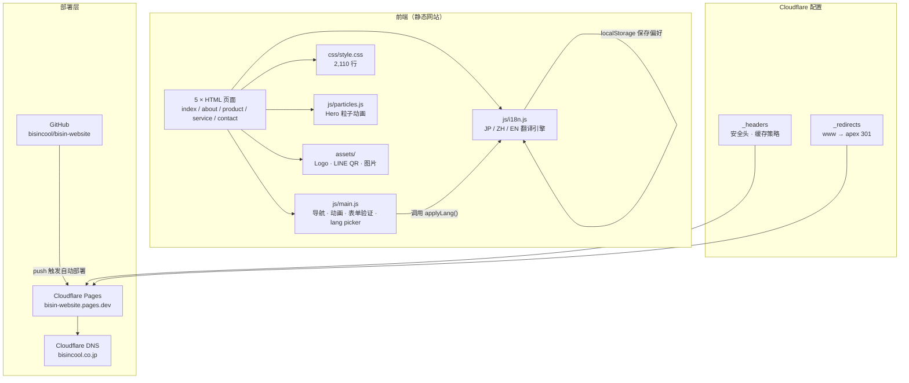
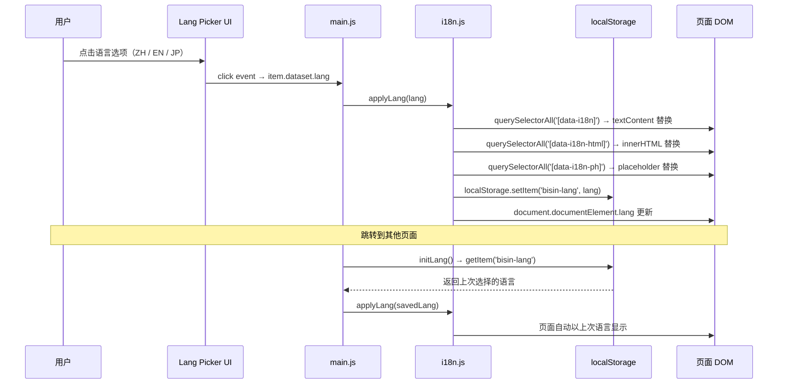
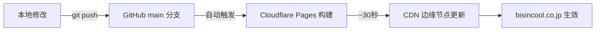

# 🧠 项目开发报告

项目名称: bisin-website（合同会社BISIN 官方网站）
更新时间: 2026-03-27

---

# 📊 项目统计

| 项目 | 数量 |
|----|-----|
| 开发步骤 | 9 |
| 成功步骤 | 8 |
| 错误记录 | 2 |
| 修复次数 | 2 |
| Git 提交次数 | 3 |
| 总代码行数 | 2,942（JS + CSS） |
| HTML 页面数 | 5 |
| data-i18n 属性总数 | 268 个（5页合计） |
| 翻译 Key 数量 | ~180 个 × 3语言 |

---

# 📁 项目结构

```
bisin-website/
├── index.html          # 首页（Hero、Overview、Stats、CTA、LINE Banner）
├── about.html          # 公司介绍（Mission、Values、Company Info）
├── product.html        # 产品页（COOLSPA 特点、规格表）
├── service.html        # 服务页（3大服务、导入流程、支持方案）
├── contact.html        # 联系页（联系表单、FAQ）
├── _headers            # Cloudflare Pages 缓存 & 安全头配置
├── _redirects          # URL 重定向规则（www → apex）
├── .gitignore
├── assets/
│   ├── bisin-logo.png       (29 KB)
│   ├── contact-line.png     (99 KB)
│   └── line-qr.png          (22 KB)
├── css/
│   └── style.css            (2,110 行)
├── js/
│   ├── i18n.js              (484 行) — 多语言翻译系统
│   ├── main.js              (225 行) — 导航、动画、语言切换、表单验证
│   └── particles.js         (123 行) — Hero 粒子动画
└── docs/
    └── project-report.md    ← 本文件
```

---

# 🗂 Git Commit 历史

| Hash | 日期 | 说明 | 变更 |
|------|------|------|------|
| `24a82f5` | 2026-03-25 | initial commit | +14 文件 / +3,663 行 |
| `63584ba` | 2026-03-25 | 实现语言切换功能（JP / ZH / EN） | +8 文件 / +792 行 / 新增 i18n.js |
| `62c5d12` | 2026-03-25 | 修复 JS 缓存问题，强制加载最新版本 | _headers + script ?v=2 |

### Commit 详情

**`24a82f5` — initial commit**
- 5 个 HTML 页面、CSS、JS、图片资源全部初始化
- 添加 `_headers`（安全头 + 缓存策略）、`_redirects`（www 重定向）

**`63584ba` — 实现语言切换功能**
- 新增 `js/i18n.js`（484 行）：JP / ZH / EN 完整翻译
- 全部 HTML 页面添加 `data-i18n` / `data-i18n-html` / `data-i18n-ph` 属性（共 268 个）
- `main.js` 更新 lang picker：选择语言 → `applyLang()` → `localStorage` 保存

**`62c5d12` — 修复 JS 缓存问题**
- `_headers`：`/js/*` 和 `/css/*` 从 `immutable` 改为 `no-cache`
- 全部 HTML script 标签加 `?v=2` 绕过旧缓存

---

# ✅ 正确流程

### Step 1 — 项目结构整理
- 删除无关文件 `get-pip.py`
- 创建 `_redirects`、`_headers`

### Step 2 — Git 初始化 & 配置
```bash
git config --global user.email "bisin202603@gmail.com"
git config --global user.name "bisincool"
git init && git add . && git commit -m "initial commit"
```

### Step 3 — 推送到 GitHub
```bash
git remote add origin https://github.com/bisincool/bisin-website.git
git branch -M main && git push -u origin main
```

### Step 4 — Cloudflare Pages 部署
- Workers & Pages → Create → Pages → Connect GitHub
- 构建配置全部留空 → Save and Deploy
- 访问地址：`https://bisin-website.pages.dev`

### Step 5 — 绑定自定义域名
- Cloudflare 添加 `bisincool.co.jp` → 获取 NS
- お名前.com 修改 NameServer → DNS 生效
- Pages → Custom domains 绑定 apex + www

### Step 6 — 多语言切换实现
- 创建 `js/i18n.js`（TRANSLATIONS 对象 + `applyLang()` + `initLang()`）
- 全部页面添加 `data-i18n` 属性
- `main.js` lang picker 调用翻译函数，`localStorage` 跨页面保持语言

### Step 7 — 缓存修复
- `_headers` 修改缓存策略
- script 标签加版本号

---

# ❌ 错误记录

### Error 1 — Git 用户身份未配置
**触发时机：** 首次 `git commit`
**报错：** `Author identity unknown — Please tell me who you are`
**原因：** 全局 git 未设置 `user.name` / `user.email`

### Error 2 — 语言切换无效（JS immutable 缓存）
**触发时机：** 部署 `63584ba` 后，Chrome / Edge 测试语言切换
**现象：** 切换中文/英文后页面仍显示日文
**原因：** `_headers` 对 `/js/*` 设置了 `Cache-Control: immutable`，浏览器和 CDN 缓存旧版 `main.js`（不含 `applyLang`），永不刷新

---

# 🔧 修复方法

### Fix 1 — 配置 Git 用户
```bash
git config --global user.email "bisin202603@gmail.com"
git config --global user.name "bisincool"
```

### Fix 2 — 修正缓存策略
`_headers` 修改：
```
# 修改前
/js/*
  Cache-Control: public, max-age=31536000, immutable

# 修改后
/js/*
  Cache-Control: no-cache
```
HTML script 标签加版本号：
```html
<script src="js/i18n.js?v=2"></script>
<script src="js/main.js?v=2"></script>
```

---

# 🔄 架构图

### 整体架构



### 多语言切换流程



### 部署流程



---

# 📈 统计

| 指标 | 数值 |
|------|------|
| 总代码行数 | 2,942（JS + CSS） |
| HTML 页面数 | 5 |
| data-i18n 属性数 | index:36 / about:47 / product:46 / service:81 / contact:58 = **268** |
| 翻译 Key × 语言 | ~180 key × 3 = ~540 条翻译 |
| Git 提交次数 | 3 |
| 部署平台 | Cloudflare Pages（Free） |
| 域名注册商 | お名前.com |
| DNS 提供商 | Cloudflare |
| NS 地址 | cosmin / grannbo .ns.cloudflare.com |
| 线上地址 | https://bisincool.co.jp |

---

# 🧩 经验总结

1. **`immutable` 缓存只适用于带版本哈希的文件名**（如 `main.abc123.js`）。普通文件名必须用 `no-cache` 或 query string 版本号，否则更新无法到达用户。

2. **Cloudflare Pages 部署成功 ≠ 用户立即看到新版本**，需要在 `_headers` 中正确区分 HTML（`no-cache`）/ JS·CSS（`no-cache`）/ 图片（`immutable`）的缓存策略。

3. **纯静态站多语言方案**：`data-i18n` 属性 + JS 替换是最简方案，无需构建工具，`localStorage` 跨页面保持语言状态，适合中小型静态网站。

4. **git 初次使用必须先配置用户身份**，建议项目开始前完成 `user.name` 和 `user.email` 的全局配置。

5. **自定义域名绑定顺序**：先把域名加入 Cloudflare（获取 NS）→ 去注册商改 NS → 等待 DNS 生效 → 再在 Pages 绑定 Custom domain，顺序错误会导致 SSL 签发失败。
